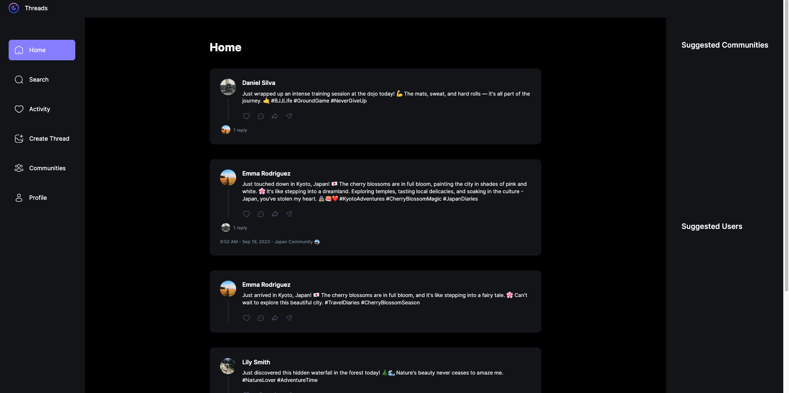
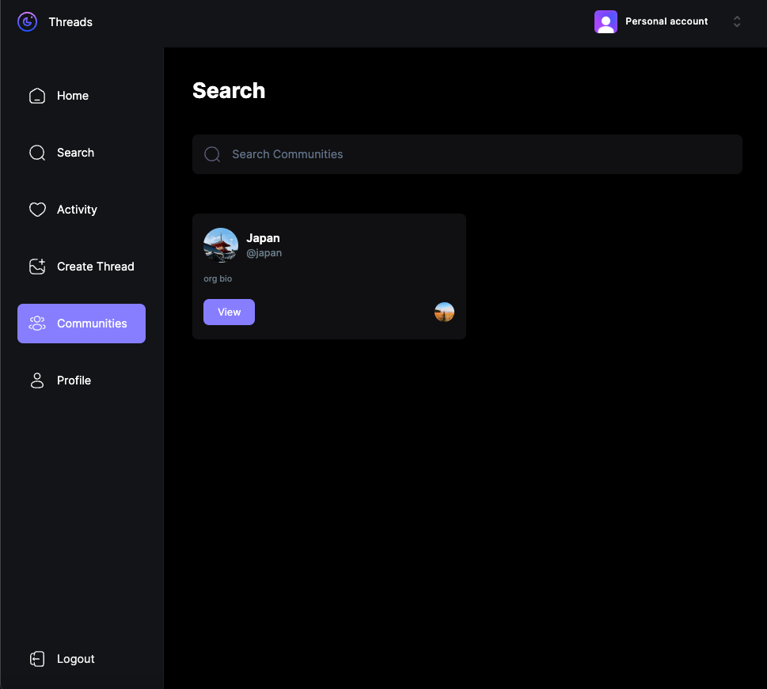
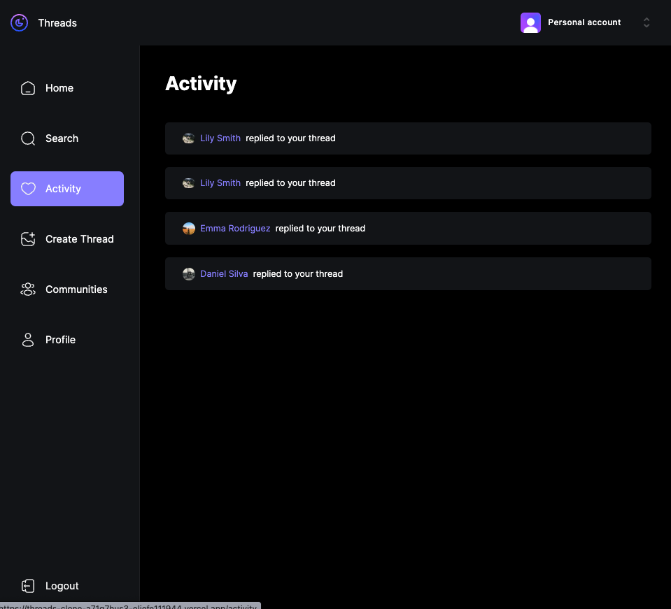
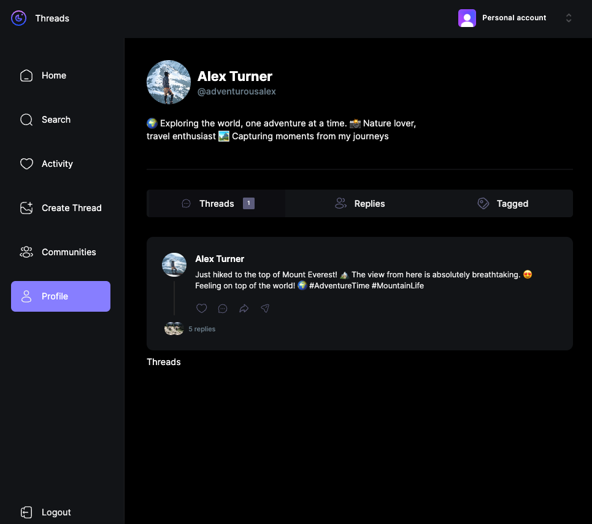
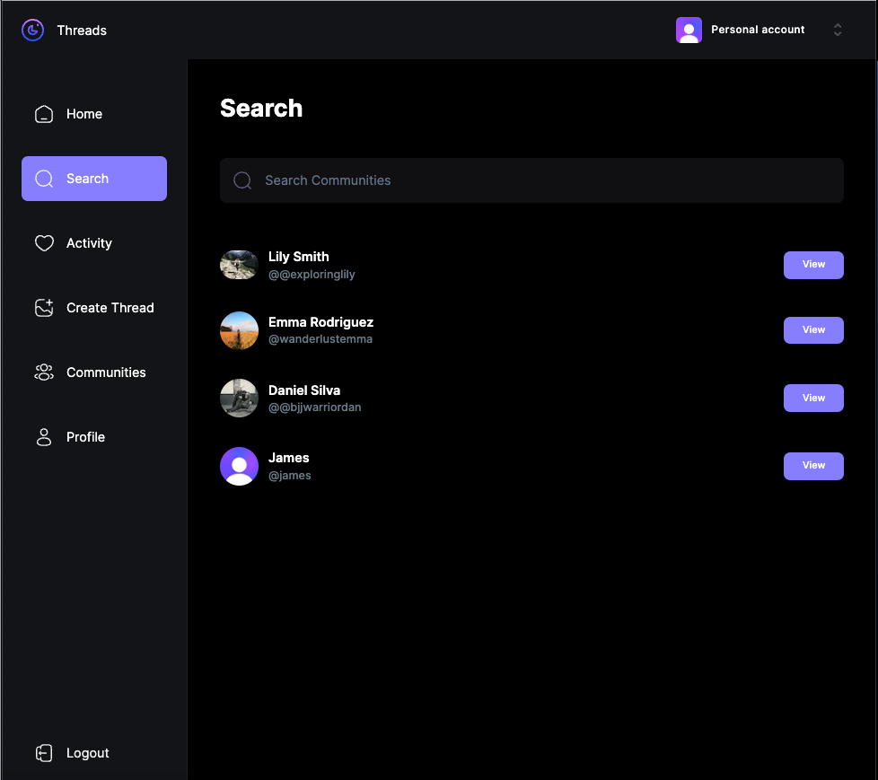
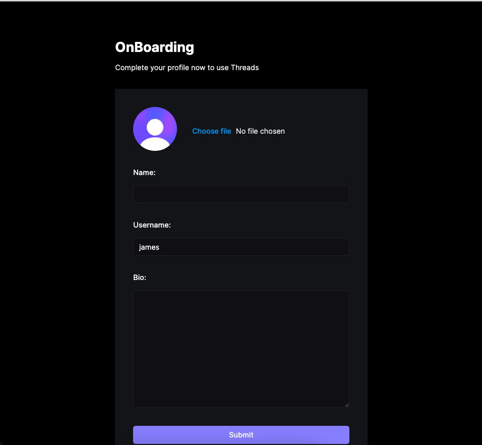
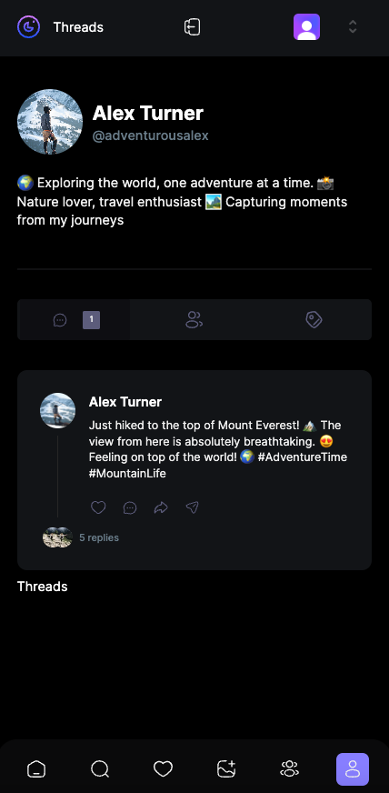
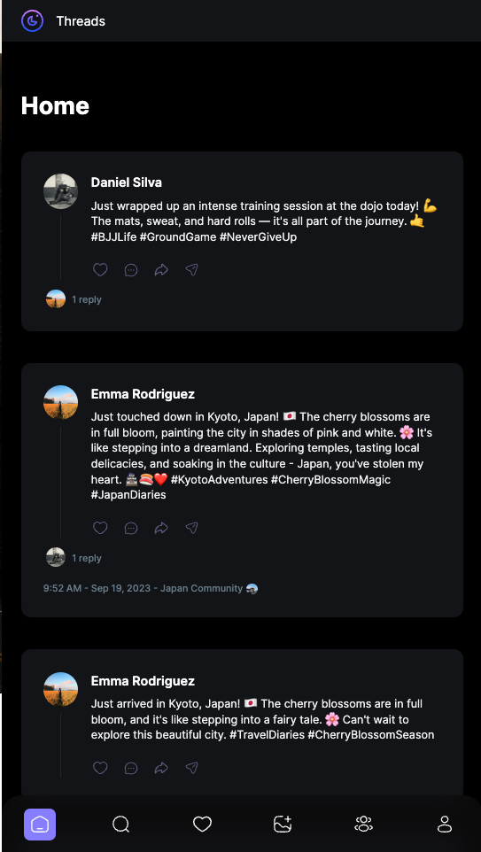

# Threads Social Media Clone

A social media clone built with modern technologies, including Next.js 13, TypeScript, MongoDB, Mongoose, Tailwind CSS, Six, Zoe, Clerk Authentication, and file upload capabilities.

### Desktop








### Mobile: 





## Table of Contents

- [Introduction](#introduction)
- [Technologies](#technologies)
- [Features](#features)
- [Getting Started](#getting-started)
- [Usage](#usage)
- [Contributing](#contributing)
- [License](#license)

## Introduction

This project is a social media clone inspired by popular social networking platforms. It provides a platform for users to post, share, and interact with content. Built using cutting-edge technologies, it offers a modern and responsive user experience.

## Technologies

- [Next.js 13](https://nextjs.org/) with TypeScript for the frontend.
- MongoDB with Mongoose for the database.
- [Tailwind CSS](https://tailwindcss.com/) for rapid UI development.
- Six (Please specify the Six library or framework used).
- Zoe (Please specify the Zoe library or framework used).
- [Clerk Authentication](https://clerk.dev/) for user authentication and management.
- [Multer](https://github.com/expressjs/multer) (or other file upload libraries/services) for handling file uploads.
- (Additional technologies and libraries used in your project).

## Features

- User registration and authentication.
- Posting and sharing text, images, and other content.
- Liking and commenting on posts.
- User profiles with avatars and bio.
- Real-time notifications.
- (List other features your project offers).

## Getting Started

To get started with this project, follow these steps:

1. Clone the repository to your local machine:

   ```bash
   git clone https://github.com/yourusername/threads-social-clone.git

cd threads-social-clone
npm install

2. Configure Environment Variables:

Configure your environment variables, including MongoDB connection details, Clerk Authentication settings, and any other required variables.

3. Run the Development Server:

Start the development server:

npm run dev

4. Access the Application:

Open your web browser and visit http://localhost:3000 to access the application.
You are now ready to start using the Threads Social Media Clone. Customize it, add features, and make it your own!


This corrected version is entirely in Markdown format. Please use it as needed in your README.md file.

## Usage

Describe how to use your application and provide any additional setup or configuration instructions.

